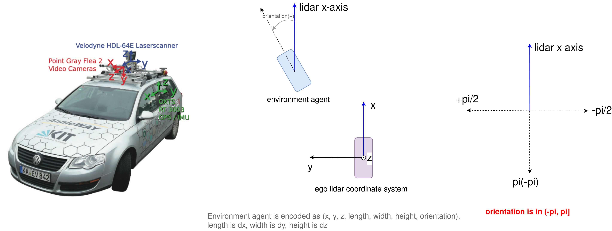
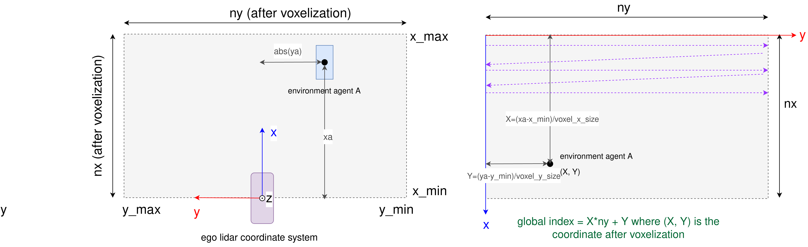

## PyTorch Implementation of Center Based Lidar 3D Object Detection for Autonomous Driving
*Solutions Architect: Gaowei Xu (gaowexu1991@gmail.com)*


### 1. Introduction
The Lidar sensor setup could be referred as the illustration figure below:



The ego front is x-axis, the left side is y-axis and the upwards is z-axis. Each position of 
environment agent is encoded with a 7-dimension vector, i.e., `(x, y, z, length, width, height, orientation)`.
orientation is in range `(-pi, pi]`, which is illustrated in above figure.


CenterPoint use point pillar to extract points cloud's features and then scatter the features to
pseudo image, the figure below illustrate the global indices detail between real physical world and 
pseudo image space. The global indexing method used in scatter module should be the same with 
the ground truth (heatmap) generation logic.




### 2. Setup Environment
#### Install Nvidia Driver and CUDA 11.6
```commandline
wget https://developer.download.nvidia.com/compute/cuda/repos/ubuntu2004/x86_64/cuda-ubuntu2004.pin
sudo mv cuda-ubuntu2004.pin /etc/apt/preferences.d/cuda-repository-pin-600
wget https://developer.download.nvidia.com/compute/cuda/11.3.0/local_installers/cuda-repo-ubuntu2004-11-3-local_11.3.0-465.19.01-1_amd64.deb
sudo dpkg -i cuda-repo-ubuntu2004-11-3-local_11.3.0-465.19.01-1_amd64.deb
sudo apt-key add /var/cuda-repo-ubuntu2004-11-3-local/7fa2af80.pub
sudo apt-get update
sudo apt-get -y install cuda
```

#### Install System Dependencies
```commandline
sudo apt-get update
sudo apt-get install -y libopencv-dev python3-pip git
```

#### Install Python Packages
Download `torch-1.10.2+cu113-cp38-cp38-linux_x86_64.whl` to local disk and then install it:
```commandline
pip3 install torch-1.10.2+cu113-cp38-cp38-linux_x86_64.whl
pip3 install -r requirements.txt
```


### 3. Model Training

### 4. Performance Evaluation

### 5. ONNX Conversion


### 6. TensorRT Conversion


### 7. CUDA C++ Integration


### 8. License
See the [LICENSE](./LICENSE) file for our project's licensing. We will ask you to confirm the licensing of your contribution.

